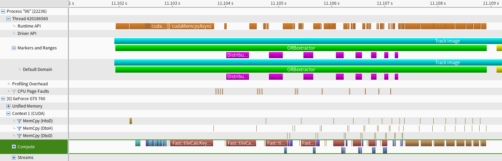
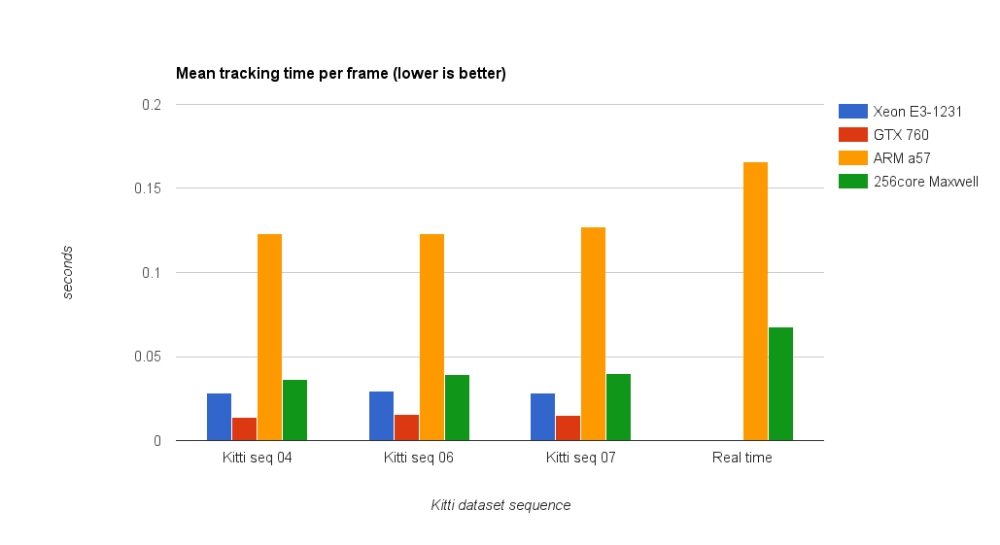

# ORB-SLAM2 GPU optimization
## GPUGPU 2016 Final Project

### Introduction

#### Video

#### Slides
[slides](slides/index.html)

### Abstract
Enable GPU optimizations to achieve real time SLAM on the Jetson TX1 embedded computer.

### Optimization details

#### Switch from OpenCV 2.4 to OpenCV 3.1
OpenCV 3.1 introduces several features helpful to this project: custom memory allocator, 
Cuda stream and rewrite of some essential algorithms, such as Fast and ORB.
These features allow us to fully exploit more Cuda APIs, such as Unified Memory.

#### Feature extraction reimplemented
There are several execution hotspots in the original `ORB_SLAM2`, including but not limited to
procedures like `FAST corner detection`, `Gaussian filter` and `ORB feature extraction`.
For example, in their `ORB feature extraction` implementation, an image is divided into many small tiles
and `FAST` is invoked on each tile one or two times in order to achieve high accuracy.
The algorithm was effective yet inefficient.
Hence we implemented a slightly modified version of it in CUDA and parallelized the work
of each tile.

`ORB feature extraction` is also a costly but parallelizable procedure, so it's implemented with CUDA, too.

#### Overlap CPU and GPU execution
However, there are still some irregular code segments that cannot be parallelized. So our next goal is to 
maximize CPU/GPU overlap. Ideally if a CPU work is completed before a GPU kernel ends, then
the CPU work would be considered "free"; unfortunately, many CPU work have data dependencies on other GPU results,
thus CPU/GPU work scheduling must be done wisely.
With the help of many profilings (thanks to NVVP), we've figured out a pretty good scheduling scheme
to pipeline CPU and GPU work, such that GPU is kept as busy as possible while CPU can overlap many
of it's execution with GPU.

The purple bars on the row "Default domain" indicates CPU work and the "Compute" row indicates GPU work.

#### Results
Following are some charts of the speedups we achieved on an ordinary PC and on a Jetson TX1.
The PC's CPU/GPU is Xeon E3 1231 / GTX 760.
The statistics were mesured using chosen sequences of the KITTI dataset and live captured images from the 
camera module on top of TX1.

After enabling GPU optimization, the fps of live camera tracking is increased from 5.98 to 14.42 and frame 
processing time is reduced from 0.166s to 0.068s !

### Contacts
B03902035 黃兆緯 <b03902035@ntu.edu.tw>
B03902074 陳耘志 <b03902074@ntu.edu.tw>
B03902082 江懿友 <b03902082@ntu.edu.tw>
